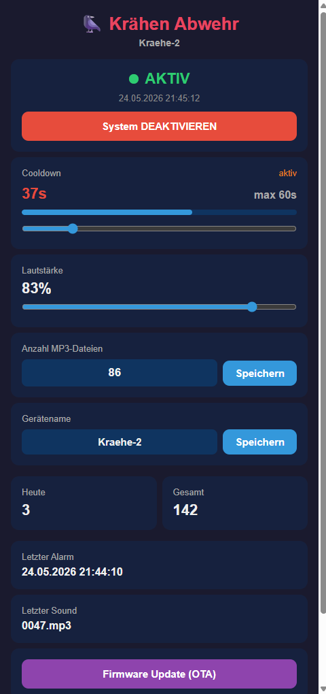

# 🐦‍⬛ Crow Deterrent System

An ESP32-based automatic bird deterrent system that plays random sounds when motion is detected.
Designed to scare away woodpeckers, crows, and other birds from wooden structures.



## Features

- Motion detection via RCWL-0516 microwave radar sensor
- Random MP3 playback with history buffer (no immediate repeats)
- Configurable cooldown between triggers
- Live web dashboard — updates without page reload
- Adjustable volume and cooldown via sliders
- Real-time cooldown countdown with progress bar
- System on/off toggle
- Trigger statistics (today / total) with flash animation on new alarm
- NTP time sync
- WiFi setup via captive portal (no hardcoded credentials)
- Accessible via mDNS hostname (e.g. `kraehe-1.local`)
- Device name configurable via dashboard — persisted in flash, survives OTA
- OTA firmware update directly via browser (no USB required after first flash)

## Hardware

| Component | Description |
|---|---|
| ESP32 S2 Mini (Wemos) | Microcontroller |
| RCWL-0516 | Microwave radar motion sensor |
| DFPlayer Mini (MP3-TF-16P) | MP3 player module |
| Speaker 8Ω | Audio output |
| 1kΩ Resistor | Between ESP32 TX and DFPlayer RX |
| Solar Powerbank (5V USB) | Power supply |
| MicroSD Card | MP3 storage |

## Wiring

### RCWL-0516 → ESP32
| RCWL-0516 | ESP32 |
|---|---|
| VIN | VBUS (5V) |
| GND | GND |
| OUT | GPIO 7 |
| 3V3 | not connected |
| CDS | not connected |

### DFPlayer Mini → ESP32
| DFPlayer | ESP32 |
|---|---|
| VCC | VBUS (5V) |
| GND | GND |
| RX | GPIO 17 (via 1kΩ resistor) |
| TX | GPIO 18 |
| SPK_1 / SPK_2 | Speaker |

### Power
- Power the ESP32 via USB from a 5V solar powerbank
- VBUS and GND pins on ESP32 supply 5V to RCWL-0516 and DFPlayer

## SD Card Setup

Name your audio files as follows and place them in a folder named `mp3` on the SD card:
```
mp3/
├── 0001.mp3
├── 0002.mp3
├── 0003.mp3
└── ...
```

## Configuration

All settings are configurable at runtime via the dashboard. The only values in `src/main.cpp` are defaults:

| Variable | Default | Description |
|---|---|---|
| `SOUND_COUNT` | `86` | Number of MP3 files (also adjustable via dashboard) |
| `NO_REPEAT_LAST` | `5` | Minimum different sounds before a sound may repeat |
| `COOLDOWN_SEC` | `60` | Seconds between triggers — default, adjustable via dashboard |
| `VOLUME` | `25` | Initial volume 0–30 — default, adjustable via dashboard |

The **Gerätename** (`Kraehe-1`, `Kraehe-2`, …) is set once per device via the dashboard after first boot and persisted in flash — it survives OTA updates.

## Installation

### Requirements
- VS Code with PlatformIO extension
- Git

### Steps
1. Clone the repository:
   ```bash
   git clone https://github.com/Psyobilin/crow-deterrent.git
   ```
2. Open in VS Code — PlatformIO detects the project automatically
3. Connect ESP32 S2 Mini via USB and flash:
   - Click Upload (→) in PlatformIO
   - Hold BOOT button when `Waiting for upload port...` appears
4. Proceed with WiFi Setup and device naming below

## WiFi Setup

On first boot the ESP32 opens a WiFi access point named `Kraehe`.

1. Connect your phone or laptop to that network
2. A captive portal opens automatically — enter your home WiFi credentials
3. The ESP32 saves the credentials to flash and restarts

From then on the device connects automatically on every boot.

**To reset WiFi:** use the "WLAN zurücksetzen" button in the dashboard.

## Dashboard

Access via:

- **IP address** — shown in the serial monitor on boot (`Verbunden! IP: 192.168.x.x`)
- **mDNS hostname** — `kraehe-x.local` (after setting the device name, see below)

The dashboard polls the device every 3 seconds and updates all values live without a page reload.

## Multiple Devices

7 units are in use. After first boot, open the dashboard and set the **Gerätename** field (e.g. `Kraehe-3`). The device restarts and is then reachable as `kraehe-3.local`. Each device only needs to be USB-flashed once — all future updates go via OTA.

## OTA Firmware Update

After making code changes:

1. Build in PlatformIO → generates `.pio/build/lolin_s2_mini/firmware.bin`
2. Open `kraehe-x.local/update` in the browser
3. Select the `.bin` file → **Hochladen & Flashen**
4. The device flashes itself and reboots — Gerätename and all settings are preserved

No USB connection required.

## Notes

- The RCWL-0516 sensor detects through plastic enclosures — ideal for weatherproof housings
- Wrap the sensor partially with aluminium foil to reduce detection range/angle
- All dashboard settings (volume, cooldown, sound count, device name) are persisted in flash
- NTP time sync requires a WiFi connection; the system runs fully offline without it
